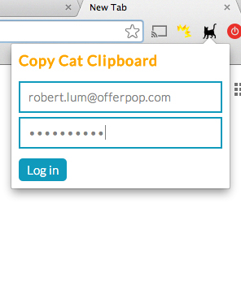
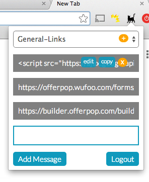
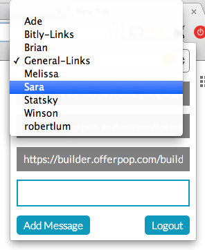

#Firebase Clipboard

###Version 2.0 - 10/08/14
- Logins working via email & password (only authorized users can access)
- Firebase remembers login status
- Logout button added

Need to fix:
- Libraries take a while to load; home screen sometimes gets cut off
- Category clears out when there are no entries in object
- Features to add:
  - Add new directory
  - Register own account
  - Security Rules to access only own account & repo
  - On load go back to last folder

###Version 1.0 - 10/06/14
- Categories working
- Features:
  - Double click X to remove snippet
  - Press copy to add snippet to clipboard
  - Press edit to edit snippet. Click outside to save

Need to fix:
- Create logins with authorization
- Category clears out when there are no entries in object
